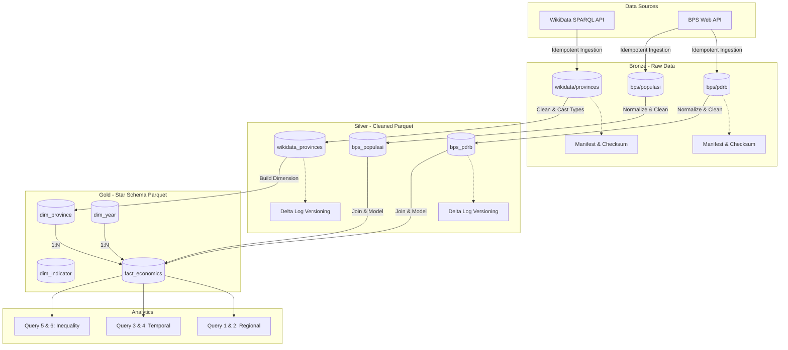

# Arsitektur Data Lakehouse

## Medallion Architecture Flow

## Komponen Teknologi
- **Storage**: MinIO (S3-compatible Object Storage) digunakan sebagai tempat penyimpanan file CSV dan Parquet di semua layer.
- **Compute**: DuckDB digunakan untuk transformasi data antar layer dan eksekusi query analitik. DuckDB secara native mendukung baca/tulis format Parquet di MinIO menggunakan ekstensi `httpfs`.
- **Orchestration**: Script Python native dengan proses yang idempotent berdasarkan komputasi *hash* MD5.
- **Data Source**: Ingestion BPS memakai API resmi `webapi.bps.go.id`; file di `data/seed/` hanya snapshot pendukung dan bukan sumber utama pipeline.

## Desain Skema Gold (Star Schema)
Skema *Star* dirancang untuk mempermudah analitik agregasi:
1. `fact_economics`: Berisi metrik PDRB dan Populasi, serta nilai turunan *GDP per capita*.
2. `dim_province`: Dimensi geografis yang diperkaya dengan data eksternal dari WikiData (Koordinat, Luas Wilayah).
3. `dim_year`: Dimensi waktu temporal.
4. `dim_indicator`: Metadata statis indikator ekonomi.

## Catatan Cakupan Data

- `dim_province` Gold Layer memuat 38 provinsi aktif berdasarkan ISO code dari Wikidata.
- BPS PDRB live menghasilkan 174 baris untuk periode 2019–2023.
- BPS populasi live menghasilkan 170 baris; endpoint populasi BPS memiliki nilai kosong untuk 4 provinsi DOB Papua baru pada 2023.
